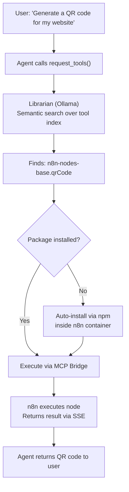
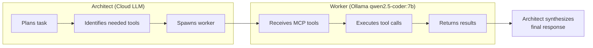

# MCP Bridge — Zero-Gap Automation

OpenPawz ships with 400+ native integrations compiled into the Rust binary. The **MCP Bridge** extends this to **25,000+** by embedding an n8n engine and connecting to it via the Model Context Protocol (MCP). Your agents discover, install, and execute any of n8n's community node types — automatically, at runtime, with zero configuration.

<Note>
This is the feature that makes OpenPawz the most connected AI agent platform in existence. No other tool — open source or commercial — offers this level of integration coverage.
</Note>

---

## How It Works



The flow is fully automatic. The user just asks for what they need — the agent figures out which integration to use, installs it if necessary, and executes it.

---

## Architecture

The MCP Bridge has four layers:

### 1. Embedded n8n Engine

n8n is auto-provisioned at app launch with zero user configuration:

| Method | How | When |
|--------|-----|------|
| **Docker** (preferred) | `bollard` crate manages a container with port 5678 mapped | Docker detected on system |
| **npx** (fallback) | `npx n8n start` as a child process | No Docker available |

The engine starts 8 seconds after app launch in a background thread. Health checks run before every MCP operation via `lazy_ensure_n8n()`.

### 2. MCP Transport

Two transport implementations in `transport.rs` (688 lines):

| Transport | Protocol | Use Case |
|-----------|----------|----------|
| **SSE** (`SseTransport`) | Server-Sent Events over HTTP | n8n connection (default) |
| **Stdio** (`StdioTransport`) | stdin/stdout JSON-RPC | External MCP servers |

The SSE transport connects to `http://127.0.0.1:5678/mcp/sse`, receives tool definitions, and sends tool calls via JSON-RPC.

### 3. Auto-Registration & Tool Remapping

`registry.rs` handles automatic MCP server registration:

- **`register_n8n()`** — registers n8n as an MCP server with `N8N_MCP_SERVER_ID`
- **`pascal_to_snake()`** — converts n8n's PascalCase tool names (e.g., `QrCode`) to snake_case (`qr_code`) for LLM compatibility
- **`mcp_tool_to_paw_def()`** — converts MCP tool schemas to Paw's internal tool format

### 4. Community Node Auto-Install

When an agent needs a tool that requires an n8n community package:

1. `COMMUNITY_PACKAGE_MAP` maps node type → npm package name
2. `getRequiredPackage()` checks if the package is needed
3. `_showAutoInstallPrompt()` presents a one-click install UI
4. Package is installed inside the n8n container/process via npm
5. MCP tool list is refreshed automatically

---

## The Architect/Worker Pattern

Cloud LLMs (Gemini, Claude, GPT) act as **Architects** — they plan and orchestrate. A local Ollama model acts as the **Worker** — it executes MCP tool calls at zero cost.



| Role | Model | Cost | Purpose |
|------|-------|------|---------|
| **Architect** | Gemini / Claude / GPT | Per-token | Planning, reasoning, user interaction |
| **Worker** | Ollama `qwen2.5-coder:7b` (~4.7 GB) | $0 | MCP tool execution, structured I/O |
| **Librarian** | Ollama `nomic-embed-text` | $0 | Semantic tool discovery (embeddings) |

---

## What Can Agents Do?

With the MCP Bridge, your agents can access any service that has an n8n community node. Here are some examples that require **no API keys**:

| Category | Examples |
|----------|----------|
| **Data Processing** | QR code generation, PDF creation, CSV parsing, JSON transformation |
| **Utilities** | UUID generation, hash computation, date/time conversion, regex matching |
| **Format Conversion** | Markdown → HTML, XML → JSON, image resize, base64 encode/decode |

And with API keys configured in n8n:

| Category | Examples |
|----------|----------|
| **CRM** | Salesforce, HubSpot, Pipedrive, Zoho, Freshdesk |
| **Project Management** | Jira, Asana, Monday.com, ClickUp, Basecamp |
| **Communication** | Twilio, SendGrid, Mailgun, Vonage, Intercom |
| **Analytics** | Google Analytics, Mixpanel, Amplitude, Segment |
| **Cloud** | AWS S3, Google Cloud Storage, Azure Blob, DigitalOcean Spaces |
| **Databases** | Airtable, Supabase, Firebase, FaunaDB, CockroachDB |
| **E-commerce** | Shopify, WooCommerce, Stripe, Square, PayPal |
| **Social Media** | Twitter/X, LinkedIn, Facebook, Instagram, TikTok |
| **DevOps** | PagerDuty, Datadog, New Relic, Sentry, Grafana |
| **AI Services** | OpenAI, Anthropic, Hugging Face, Replicate, Stability AI |

---

## Setup

The MCP Bridge requires **zero configuration** for basic operation. Everything is auto-provisioned.

### Prerequisites

| Requirement | Required? | Purpose |
|-------------|-----------|---------|
| **Docker** | Recommended | Preferred n8n runtime (container isolation) |
| **Node.js 18+** | Fallback | Used if Docker is not available (`npx n8n start`) |
| **Ollama** | Required | Local worker model + embedding model |

### Ollama Models

Three Ollama models power the system:

```bash
# Worker model — executes MCP tool calls
ollama pull qwen2.5-coder:7b

# Embedding model — semantic tool discovery + memory
ollama pull nomic-embed-text

# Chat fallback — default offline chat model
ollama pull llama3.2:3b
```

### Verify It's Working

After launching OpenPawz, check the logs for:

```
[n8n] Starting embedded n8n engine...
[mcp] Auto-registering n8n as MCP server at http://127.0.0.1:5678/mcp
[mcp:sse] Connecting to http://127.0.0.1:5678/mcp/sse
```

You can also check n8n status in **Settings → Advanced → n8n Engine**.

---

## Community Node Browser

OpenPawz includes a built-in **Community Browser** UI for discovering n8n community packages:

1. Open **Settings → Advanced → Community Nodes**
2. Search the n8n community registry
3. Click **Install** to add a package
4. The MCP tool list refreshes automatically

Alternatively, agents can discover and install packages conversationally:

> "I need to generate QR codes"
>
> *Agent searches community nodes, finds n8n-nodes-base.qrCode, installs the package, and generates the QR code — all in one conversation.*

---

## vs. Zapier / Make / n8n Standalone

| | **OpenPawz MCP Bridge** | **Zapier** | **Make** | **n8n (standalone)** |
|---|---|---|---|---|
| **Integrations** | 25,000+ | 7,000+ | 2,000+ | 400+ built-in |
| **AI-driven** | Agents discover & execute | Manual setup | Manual setup | Manual setup |
| **Auto-install** | On-demand, at runtime | Pre-configured | Pre-configured | Manual npm install |
| **Cost** | $0 (local Ollama worker) | $20–600/mo | $9–300/mo | Free (self-hosted) |
| **Natural language** | "Generate a QR code" | Drag-and-drop | Drag-and-drop | Drag-and-drop |
| **Privacy** | 100% local | Cloud | Cloud | Self-hosted option |
| **Multi-agent** | Yes | No | No | No |

---

## Troubleshooting

| Problem | Solution |
|---------|----------|
| n8n not starting | Check Docker is running (`docker ps`) or Node.js 18+ is available (`node --version`) |
| SSE stream closes immediately | Expected if no MCP workflows are deployed yet. Install a community package first. |
| "No MCP tools available" | Run `mcp_refresh` or restart the app. Check that n8n is healthy at `http://localhost:5678`. |
| Community package install fails | Ensure n8n has network access. Check container logs: `docker logs openpawz-n8n`. |
| Worker model not found | Run `ollama pull qwen2.5-coder:7b` to download the worker model. |

---

## Security

- n8n runs **locally** — no cloud relay, no data leaves your machine
- Community packages are installed from the **official npm registry**
- MCP transport uses **localhost-only** connections (127.0.0.1:5678)
- All tool calls go through OpenPawz's **Human-in-the-Loop approval** system
- Credential injection for n8n nodes uses the same **AES-256-GCM encrypted vault**
- The MCP Bridge inherits all 10 security layers from the core platform
