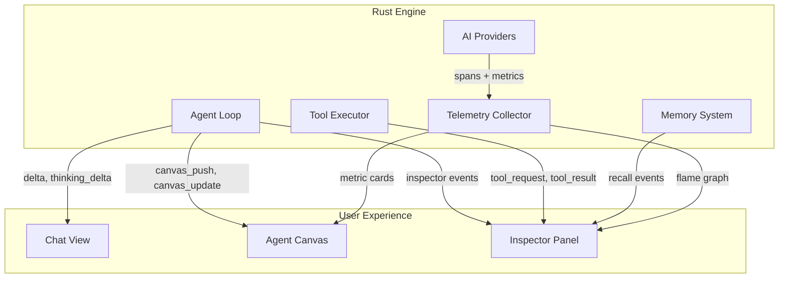
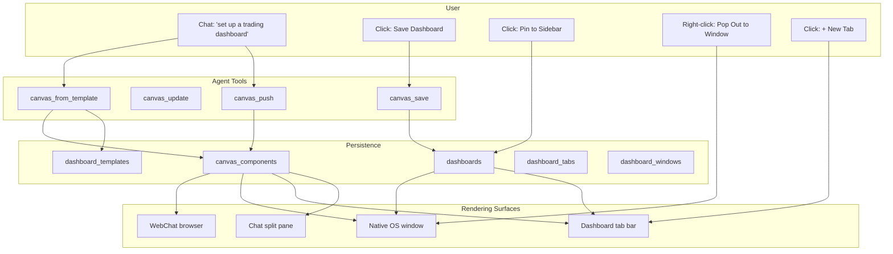

# The Agent Canvas

**Generative UI, Live Observability, and Agent-Built Dashboards**

*Open source (MIT). Part of the OpenPawz project.*

---

## The Problem

Today's AI agents are black boxes that output text. You ask an agent to analyze your CI pipeline, and it writes four paragraphs. You ask it to monitor your portfolio, and it dumps a table into a chat bubble. You ask it to track a deployment, and it says "done" — but you can't _see_ anything.

This creates three pain points that compound as agents get more capable:

1. **Invisible execution.** What is the agent doing right now? Why has it been "thinking" for 12 seconds? Which tools did it call, and in what order? Debugging agent behavior means reading logs — the equivalent of debugging a web app by reading `console.log` output in a text file.

2. **Flat output.** Agents produce text, but humans think in dashboards, charts, and spatial layouts. A trading agent should show you a live P&L curve, not a paragraph describing your positions. A research agent should show you a structured findings table, not a wall of markdown.

3. **Ephemeral results.** Even when an agent produces useful structured data, it vanishes when you scroll up. There's no persistent surface where agent-generated insights accumulate and stay accessible.

Microsoft's "Golden Triangle" — [AG-UI](https://docs.ag-ui.com/introduction), DevUI, and OpenTelemetry — identifies these exact gaps. The Agent Canvas is how Pawz solves all three in a single, coherent architecture.

---

## The Invention

The Agent Canvas introduces three layers that work together:

| Layer | What it does | Analogy |
|-------|-------------|---------|
| **Canvas** (Generative UI) | Agents push live UI components — charts, tables, metrics, forms — into a persistent visual surface | AG-UI |
| **Inspector** (Agent X-Ray) | Real-time chain-of-thought, tool routing, memory recall, and context utilization — visible alongside the chat | DevUI |
| **Telemetry** (Observability) | Structured tracing across the full request lifecycle with cost, latency, and token metrics surfaced in the UI | OpenTelemetry |

Each layer is independently useful. Together they transform Pawz from "chat with an agent" to "work with an agent that shows you what it's doing and what it found."



---

## Layer 1: The Canvas — Generative UI

### What Exists Today

Pawz already has a generative UI primitive: the **skill output** system.

Agents call the `skill_output` tool with structured data (type, title, JSON payload), which is persisted to the `skill_outputs` SQLite table and rendered as widget cards on the Today dashboard. Five widget types exist: `status`, `metric`, `table`, `log`, `kv`.

This works, but it's limited in three ways:

1. **Post-hoc only.** Widgets appear on the Today dashboard after execution — they are not visible during the agent turn.
2. **Static.** Once rendered, a widget cannot be updated in real-time. The agent would need to call `skill_output` again and the user would need to refresh.
3. **Flat namespace.** All widgets share the Today dashboard. There's no concept of a per-session or per-agent canvas that groups related widgets into a coherent view.

### What Changes

The Agent Canvas introduces a **live rendering surface** that agents populate during execution. Components appear as the agent streams — the user watches the dashboard materialize.

```
User: "Analyze my project's CI pipeline and show me the bottlenecks"

Agent turn (streaming):
  Round 1: Agent calls request_tools("GitHub CI analytics")
           → Librarian returns github_list_workflows, github_get_run
  Round 2: Agent calls github_list_workflows(...)
           → 12 workflows returned
           Agent calls canvas_push({
             type: "table",
             title: "CI Workflows",
             columns: ["Name", "Last Run", "Duration", "Status"],
             rows: [...]
           })
           ← TABLE APPEARS IN CANVAS (live)
  Round 3: Agent analyzes durations, calls canvas_push({
             type: "chart",
             title: "Build Duration Trend (30d)",
             chart_type: "line",
             series: [...]
           })
           ← CHART APPEARS BELOW TABLE (live)
  Round 4: Agent calls canvas_push({
             type: "metric",
             title: "Slowest Step",
             value: "TypeScript compilation",
             detail: "4m 23s avg — 62% of total build time"
           })
           Agent calls canvas_push({
             type: "card",
             title: "Recommendation",
             body: "Enable incremental TS builds...",
             actions: [{ label: "Create Issue", tool: "github_create_issue", args: {...} }]
           })
           ← METRIC + ACTION CARD APPEAR (live)
  Complete: "I've analyzed your CI pipeline — the dashboard is ready."
```

The Canvas window shows four components laid out in a responsive bento grid. The user can interact with the "Create Issue" action card, which triggers a tool call with confirmation.

### Architecture

#### New Tauri Events

Two new `EngineEvent` variants:

```rust
pub enum EngineEvent {
    // ... existing variants ...

    /// Agent pushes a new component to the canvas.
    CanvasPush {
        session_id: String,
        run_id: String,
        agent_id: String,
        component_id: String,
        component: CanvasComponent,
    },

    /// Agent updates an existing canvas component in-place.
    CanvasUpdate {
        session_id: String,
        run_id: String,
        agent_id: String,
        component_id: String,
        patch: CanvasComponentPatch,
    },
}
```

These use the existing Tauri event system (`app_handle.emit("engine-event", &event)`) — no new transport needed.

#### Canvas Components

```rust
pub struct CanvasComponent {
    pub component_type: CanvasComponentType,
    pub title: String,
    pub data: serde_json::Value,
    pub position: Option<CanvasPosition>,  // optional grid placement hint
}

pub enum CanvasComponentType {
    Metric,     // single value + trend + label
    Table,      // columns + rows (paginated)
    Chart,      // line, bar, area, pie (lightweight — no JS charting lib)
    Log,        // timestamped entries with levels
    Kv,         // key-value pairs with typed formatting
    Card,       // markdown body + optional action buttons
    Status,     // icon + text + badge
    Progress,   // label + percentage + ETA
    Form,       // input fields → triggers tool call on submit
    Markdown,   // freeform rendered markdown
    Timeline,   // visual phase/milestone timeline with status
    Checklist,  // task list with progress bar
    Gauge,      // animated radial meter (SVG)
    Countdown,  // live countdown timer to a target date
    Image,      // image display with caption
    Embed,      // sandboxed HTML/CSS/JS (enables three.js, anime.js, D3, etc.)
}
```

This extends the existing 5 `skill_output` widget types with 11 new types. The original types are kept for backward compatibility.

#### Agent Tools

Two new tools available to agents:

| Tool | Purpose |
|------|---------|
| `canvas_push` | Add a new component to the active canvas. Returns `component_id`. |
| `canvas_update` | Update an existing component by `component_id`. Accepts partial data (patch). |

These are registered in the `dashboard` tool domain so agents discover them via the Librarian when intent suggests visualization ("show me", "display", "chart", "dashboard", "monitor").

```
Agent calls: request_tools("data visualization and dashboards")
Librarian returns: canvas_push, canvas_update, skill_output, delete_skill_output
```

#### Persistence

Canvas components are persisted to a new `canvas_components` table:

```sql
CREATE TABLE IF NOT EXISTS canvas_components (
    id TEXT PRIMARY KEY,                              -- component_id
    session_id TEXT,                                   -- ties to session (NULL for dashboard-scoped)
    dashboard_id TEXT,                                 -- ties to saved dashboard (NULL for session-scoped)
    agent_id TEXT NOT NULL DEFAULT 'default',
    component_type TEXT NOT NULL,
    title TEXT NOT NULL,
    data TEXT NOT NULL DEFAULT '{}',                   -- JSON
    position TEXT,                                     -- JSON grid hint
    created_at TEXT NOT NULL DEFAULT (datetime('now')),
    updated_at TEXT NOT NULL DEFAULT (datetime('now'))
);
CREATE INDEX IF NOT EXISTS idx_canvas_session ON canvas_components(session_id);
CREATE INDEX IF NOT EXISTS idx_canvas_dashboard ON canvas_components(dashboard_id);
CREATE INDEX IF NOT EXISTS idx_canvas_agent ON canvas_components(agent_id);
```

Components with `session_id` set are ephemeral — tied to a conversation. Components with `dashboard_id` set belong to a saved dashboard. When a canvas is saved as a dashboard, its components are re-scoped from session to dashboard.


#### Charts Without a Charting Library

For `chart` components, the Canvas renders lightweight SVG charts directly — no D3, Chart.js, or other dependency. This matches Pawz's no-framework philosophy:

- **Line/area charts**: SVG `polyline` + `polygon` with calculated viewBox
- **Bar charts**: SVG `rect` elements with proportional heights
- **Pie charts**: SVG `path` with arc calculations
- **Sparklines**: Minimal SVG inline in metric cards

The chart renderer is a pure function: `(data: ChartData) → string` (SVG markup). This keeps the bundle tiny and avoids the security surface of a charting library in a desktop app.

#### Rich Visual Widgets

Beyond static content, the Canvas includes widgets that bring dashboards to life with animation, interactivity, and embedded content:

| Widget | Data Shape | Rendering |
|--------|-----------|-----------|
| `timeline` | `{ events: [{ label, time?, detail?, status: "done"\|"active"\|"pending" }] }` | Vertical timeline with colored dots (done=green, active=pulsing accent, pending=hollow) |
| `checklist` | `{ items: [{ label, checked: bool }] }` | Task list with progress bar and animated fill |
| `gauge` | `{ value, min?, max?, unit?, label?, level?: "ok"\|"warning"\|"error" }` | SVG half-circle radial meter with animated entrance |
| `countdown` | `{ target: "ISO-date", label?, format?: "dhms" }` | Live-ticking countdown timer (days:hrs:min:sec) |
| `image` | `{ src: "url", alt?, caption? }` | Image display with optional caption |
| `embed` | `{ html?, css?, js?, height?, libraries?: ["url", ...] }` | **Sandboxed iframe** — full HTML/CSS/JS with external library support |

#### The `embed` Widget — Unlimited Visual Power

The `embed` type is the canvas escape hatch. It renders a **sandboxed iframe** (`sandbox="allow-scripts"` without `allow-same-origin`) containing arbitrary HTML, CSS, and JavaScript. The agent can include external libraries via CDN:

```
Agent calls: canvas_push({
  type: "embed",
  title: "3D Portfolio Visualization",
  data: {
    libraries: [
      "https://cdnjs.cloudflare.com/ajax/libs/three.js/r128/three.min.js"
    ],
    html: "<div id='scene'></div>",
    css: "#scene { width: 100%; height: 100%; }",
    js: "const scene = new THREE.Scene(); ...",
    height: 400
  }
})
```

Supported libraries include (but are not limited to):
- **three.js** — 3D scenes, data visualizations, particle effects
- **anime.js** — Choreographed animations, morphing, timelines
- **D3.js** — Advanced data-driven visualizations
- **Chart.js** — Quick charts beyond the built-in SVG renderer
- **p5.js** — Creative coding, generative art
- Any library loadable via CDN `<script>` tag

Security: the iframe sandbox prevents access to the parent page's DOM, cookies, storage, and navigation. The embedded content runs in complete isolation.

### Relationship to Skill Outputs

The existing `skill_output` system is preserved. It serves a different purpose:

| Feature | Skill Outputs | Canvas |
|---------|--------------|--------|
| **When** | After agent turn completes | During agent turn (live streaming) |
| **Where** | Today dashboard (global) | Session canvas (per-conversation) |
| **Scope** | Cross-session (persists by skill_id) | Per-session (persists by session_id) |
| **Updates** | Upsert by (skill_id, agent_id) | Patch by component_id |
| **Use case** | Skill status cards, extension dashboards | Dynamic analysis, monitoring, workflows |

An agent can use both: `canvas_push` for live visualization during a conversation, and `skill_output` to persist a summary widget on the Today dashboard after it's done.

---

## Saved Dashboards, Templates, Tabs, and Multi-Window

Not every canvas is throwaway. A trading dashboard you check every morning, a CI monitor you keep open during releases, a project health overview that lives for weeks — some dashboards become permanent fixtures of how you work.

The Canvas supports a full **dashboard lifecycle**: ephemeral → saved → pinned → live. It supports **templates** for reusable blueprints, a **tab system** for managing multiple dashboards, and **native OS windows** for popping dashboards out of the app entirely.

### Dashboard Lifecycle

| State | Behavior |
|-------|----------|
| **Ephemeral** | Default. Tied to a chat session. The agent builds it during a conversation. Persisted in `canvas_components` but only loads when that session is reopened. |
| **Saved** | User clicks "Save Dashboard" or agent calls `canvas_save`. Gets a name, icon, and entry in the dashboards list. Survives independently of the originating session. |
| **Pinned** | A saved dashboard marked as always-available. Appears in the sidebar under a "Dashboards" group — same level as Today, Tasks, Research. |
| **Live** | A saved dashboard with an associated agent + refresh schedule. The agent periodically re-runs to update the components. Like a cron job that paints a dashboard. |

#### How Saving Works

```
User: "Save this as my CI dashboard"

Agent calls: canvas_save({
  name: "CI Dashboard",
  icon: "rocket_launch",
  pinned: true,
  refresh: { agent_id: "default", interval: "30m", prompt: "Refresh CI metrics" }
})

→ Engine creates a dashboard record
→ Components are cloned from session scope to dashboard scope
→ Dashboard appears in sidebar
→ Every 30 minutes, the agent re-runs the refresh prompt against this dashboard
```

Or manually — the user clicks the save icon in the canvas toolbar, names it, and optionally pins it.

#### Persistence

```sql
CREATE TABLE IF NOT EXISTS dashboards (
    id TEXT PRIMARY KEY,
    name TEXT NOT NULL,
    icon TEXT NOT NULL DEFAULT 'dashboard',
    agent_id TEXT NOT NULL DEFAULT 'default',
    source_session_id TEXT,                           -- originating session (nullable)
    template_id TEXT,                                 -- if created from template (nullable)
    pinned INTEGER NOT NULL DEFAULT 0,
    refresh_interval TEXT,                            -- NULL = manual, '30m', '1h', '6h', '1d'
    refresh_prompt TEXT,                              -- agent prompt for refresh runs
    last_refreshed_at TEXT,
    created_at TEXT NOT NULL DEFAULT (datetime('now')),
    updated_at TEXT NOT NULL DEFAULT (datetime('now'))
);
CREATE INDEX IF NOT EXISTS idx_dashboards_pinned ON dashboards(pinned);
```

#### Agent Tools for Dashboard Lifecycle

| Tool | Purpose |
|------|---------|  
| `canvas_save` | Save the current canvas as a named dashboard. Params: `name`, `icon`, `pinned`, `refresh`. |
| `canvas_load` | Load a saved dashboard by name or ID into the active canvas. |
| `canvas_list_dashboards` | List all saved dashboards (for the agent to reference). |
| `canvas_delete_dashboard` | Delete a saved dashboard and its components. |

These are in the `dashboard` tool domain alongside `canvas_push` / `canvas_update`.

### Dashboard Templates

Templates are **reusable dashboard blueprints** — a set of component definitions with placeholder data that an agent instantiates and populates. Think of them as the difference between an empty spreadsheet template and a filled-in spreadsheet.

#### Where Templates Come From

1. **Agent-created.** Any saved dashboard can be exported as a template by stripping its live data and keeping the component structure:

```
User: "Turn my CI dashboard into a template"

Agent calls: canvas_create_template({
  name: "CI Pipeline Monitor",
  description: "GitHub Actions build health, duration trends, and bottleneck analysis",
  components: [
    { type: "metric", title: "Slowest Step", data_hint: "Build step name + duration" },
    { type: "metric", title: "Pass Rate", data_hint: "Percentage of green builds" },
    { type: "table", title: "Workflows", columns: ["Name", "Duration", "Status", "Last Run"] },
    { type: "chart", title: "Build Duration (30d)", chart_type: "line", data_hint: "Daily build durations" }
  ],
  tags: ["ci", "github", "devops"],
  setup_prompt: "Fetch GitHub Actions workflows and build metrics for the user's repositories"
})
```

2. **Built-in.** Pawz ships with starter templates for common use cases:

| Template | Components | Domain |
|----------|-----------|--------|
| Trading Overview | Portfolio value, P&L chart, open positions table, recent trades log | Trading |
| Project Health | Task burndown chart, agent activity log, file change metrics, blockers table | Projects |
| System Monitor | CPU/memory metrics, token usage chart, cost tracker, active channels status | System |
| Research Board | Findings table, source log, key insights cards, topic progress bars | Research |
| Email Digest | Unread count metric, priority inbox table, thread activity chart | Email |

3. **Community.** Templates are shareable through PawzHub (the existing skill marketplace). A template is just a JSON manifest — same distribution mechanism as community skills:

```
pawzhub://template/ci-pipeline-monitor
```

#### How Instantiation Works

```
User: "Set up a trading dashboard"

Agent:
  1. Discovers template: request_tools("dashboard templates") → canvas_list_templates
  2. Finds match: canvas_list_templates() → [ ..., { id: "trading-overview", name: "Trading Overview" } ]
  3. Instantiates: canvas_from_template({ template_id: "trading-overview" })
     → Engine creates a new dashboard from template skeleton
     → Components created with empty/placeholder data
  4. Populates: Agent runs the template's setup_prompt against live data
     → canvas_update for each component with real data
  5. Saves: canvas_save({ name: "My Trading Dashboard", pinned: true, refresh: { interval: "5m" } })
```

The template provides structure. The agent provides data. The user gets a fully populated dashboard in one conversation turn.

#### Persistence

```sql
CREATE TABLE IF NOT EXISTS dashboard_templates (
    id TEXT PRIMARY KEY,
    name TEXT NOT NULL,
    description TEXT NOT NULL DEFAULT '',
    icon TEXT NOT NULL DEFAULT 'dashboard_customize',
    components TEXT NOT NULL DEFAULT '[]',           -- JSON array of component skeletons
    tags TEXT NOT NULL DEFAULT '[]',                 -- JSON array of string tags
    setup_prompt TEXT,                               -- agent prompt to populate from live data
    source TEXT NOT NULL DEFAULT 'builtin',          -- 'builtin', 'user', 'community'
    created_at TEXT NOT NULL DEFAULT (datetime('now'))
);
```

#### Agent Tools for Templates

| Tool | Purpose |
|------|---------|  
| `canvas_list_templates` | List available templates (built-in + user-created + community). |
| `canvas_from_template` | Instantiate a template as a new dashboard with placeholder components. |
| `canvas_create_template` | Save the current dashboard structure as a reusable template. |

### Tabs — Multiple Dashboards in One View

A user working with Pawz might have three, five, or ten dashboards they care about at once. The Canvas uses a **tab bar** to manage multiple dashboards within a single view — the same UX pattern as browser tabs or VS Code editor tabs.

#### Tab Layout

```
┌─────────────────────────────────────────────────────────────────┐
│  ┌──────────┐ ┌─────────────┐ ┌──────────┐ ┌───┐              │
│  │ Trading ▼│ │ CI Pipeline │ │ Research │ │ + │              │
│  └──────────┘ └─────────────┘ └──────────┘ └───┘              │
│  ─────────────────────────────────────────────────────────────  │
│                                                                 │
│  ┌─────────┐ ┌─────────┐ ┌───────────────────────────────┐    │
│  │ METRIC  │ │ METRIC  │ │ CHART                         │    │
│  │ P&L     │ │ Win %   │ │ Portfolio (7d)                │    │
│  │ +$1,247 │ │ 68.4%   │ │ ╱╲  ╱╲                      │    │
│  │ ▲ +3.2% │ │ ▲ +1.1% │ │╱  ╲╱  ╲____                │    │
│  └─────────┘ └─────────┘ └───────────────────────────────┘    │
│                                                                 │
│  ┌─────────────────────────────────────────────────────────┐   │
│  │ TABLE: Open Positions                                   │   │
│  │ Token  │ Entry   │ Current │ P&L     │ Size            │   │
│  │ ETH    │ $3,120  │ $3,245  │ +$125   │ 1.2 ETH        │   │
│  │ SOL    │ $142    │ $156    │ +$84    │ 6.0 SOL        │   │
│  └─────────────────────────────────────────────────────────┘   │
│                                                                 │
│  ┌──────────────────────────────────┐                          │
│  │ LOG: Recent Trades              │                          │
│  │ 14:32  Bought 1.2 ETH @ $3,120  │                          │
│  │ 14:28  Sold 0.5 SOL @ $155      │                          │
│  └──────────────────────────────────┘                          │
└─────────────────────────────────────────────────────────────────┘
```

#### Tab Types

| Tab Type | Source | Behavior |
|----------|--------|----------|
| **Session tab** | Current chat session's canvas | Ephemeral — disappears when session changes |
| **Saved tab** | Saved dashboard | Permanent — persists across app restarts |
| **Pinned tab** | Pinned dashboard | Always visible in tab bar, cannot be accidentally closed |
| **Live tab** | Dashboard with refresh schedule | Shows a pulse indicator, auto-updates on schedule |

#### Tab Operations

- **Click** a tab to switch dashboards
- **Middle-click** or **×** to close (pinned tabs require confirmation)
- **Drag** to reorder
- **Right-click** for context menu: Close, Close Others, Pin/Unpin, Pop Out to Window, Duplicate, Refresh Now
- **`+` button** opens a dashboard picker: saved dashboards, templates, or "New blank canvas"
- **Tab overflow** — when tabs exceed available width, a `›` dropdown shows the full list (same pattern as VS Code tab overflow)

#### Tab State Persistence

Open tabs are persisted so the workspace restores on app launch:

```sql
CREATE TABLE IF NOT EXISTS dashboard_tabs (
    id TEXT PRIMARY KEY,
    dashboard_id TEXT NOT NULL,
    tab_order INTEGER NOT NULL DEFAULT 0,
    active INTEGER NOT NULL DEFAULT 0,               -- 1 = currently visible tab
    window_id TEXT NOT NULL DEFAULT 'main',           -- which OS window owns this tab
    created_at TEXT NOT NULL DEFAULT (datetime('now'))
);
```

On startup, Pawz restores the tab bar exactly as the user left it — same order, same active tab.

### Multi-Window — Dashboards as Native OS Windows

This is the key UX unlock: **dashboards don't have to live inside the Pawz app**. Any tab can be popped out into its own native OS window. The user arranges Pawz and their dashboard windows across monitors, workspaces, or virtual desktops however they want.

#### How It Works

Tauri v2's `WebviewWindowBuilder` creates additional native windows at runtime. Each window is a lightweight webview that renders a single dashboard (or its own tab bar of dashboards) — no sidebar, no chat, no navigation chrome. Just the bento grid of components.

```rust
use tauri::WebviewWindowBuilder;

pub fn pop_out_dashboard(
    app: &tauri::AppHandle,
    dashboard_id: &str,
    title: &str,
) -> Result<(), String> {
    let label = format!("canvas-{}", dashboard_id);
    WebviewWindowBuilder::new(app, &label, tauri::WebviewUrl::App(
        format!("/canvas?dashboard={}", dashboard_id).into()
    ))
    .title(title)
    .inner_size(900.0, 700.0)
    .resizable(true)
    .build()
    .map_err(|e| e.to_string())?;
    Ok(())
}
```

#### The Multi-Window Workflow

```
┌─ Monitor 1 ──────────────────────────────────────────────────┐
│                                                               │
│  ┌─ Pawz Main Window ───────────────────────────────────┐    │
│  │  [sidebar] │ Chat with Agent                         │    │
│  │            │                                         │    │
│  │  Today     │  User: How are my trades doing?         │    │
│  │  Agents    │                                         │    │
│  │  Tasks     │  Agent: Your ETH position is up 4%.     │    │
│  │  Research  │  I've updated the trading dashboard     │    │
│  │  ─────     │  in window 2.                           │    │
│  │  Dashboards│                                         │    │
│  │   Trading ◉│                                         │    │
│  │   CI      ◉│                                         │    │
│  │   Research │                                         │    │
│  │            │                                         │    │
│  └────────────┴─────────────────────────────────────────┘    │
│                                                               │
└───────────────────────────────────────────────────────────────┘

┌─ Monitor 2 ──────────────────────────────────────────────────┐
│                                                               │
│  ┌─ Trading Dashboard (native window) ──────────────────┐   │
│  │  ┌─────────┐ ┌─────────┐ ┌─────────────────────────┐ │   │
│  │  │ P&L     │ │ Win %   │ │ Portfolio (7d)          │ │   │
│  │  │ +$1,247 │ │ 68.4%   │ │ ╱╲  ╱╲                │ │   │
│  │  └─────────┘ └─────────┘ └─────────────────────────┘ │   │
│  │  ┌───────────────────────────────────────────────────┐│   │
│  │  │ Open Positions                                    ││   │
│  │  │ ETH  +$125   SOL  +$84   BTC  -$32              ││   │
│  │  └───────────────────────────────────────────────────┘│   │
│  └──────────────────────────────────────────────────────┘    │
│                                                               │
│  ┌─ CI Dashboard (native window) ───────────────────────┐   │
│  │  Pass Rate: 94.2%   │  Build Trend (30d)             │   │
│  │  Slowest: TS comp   │  ╱╲  ╱╲                       │   │
│  │  4m 23s              │ ╱  ╲╱  ╲____                 │   │
│  └──────────────────────────────────────────────────────┘    │
│                                                               │
└───────────────────────────────────────────────────────────────┘
```

Pawz main app on monitor 1 for chatting. Two dashboard windows on monitor 2 for at-a-glance monitoring. Each window updates independently — when an agent pushes a `CanvasUpdate`, the event reaches all windows rendering that dashboard.

#### Window Management

| Action | How |
|--------|-----|
| **Pop out** | Right-click tab → "Pop Out to Window", or drag tab out of tab bar |
| **Pop back in** | Close the window → dashboard returns as a tab in the main app |
| **Multiple instances** | Same dashboard can be open as a tab AND a window (both stay in sync) |
| **Window memory** | Window position and size remembered per dashboard. Next pop-out restores same geometry. |
| **App quit** | All windows close together. On relaunch, popped-out dashboards restore as tabs (or optionally restore the full window layout). |

#### Event Routing Across Windows

When the engine emits a `CanvasPush` or `CanvasUpdate`, Tauri delivers it to **every window**. Each window's event listener filters by dashboard:

```typescript
pawEngine.on('canvas_push', (event) => {
  if (event.dashboard_id === currentDashboardId) {
    renderComponent(event.component_id, event.component);
  }
});
```

Main app tab, popped-out window, and WebChat all stay in sync automatically. One agent update → all views reflect it instantly.

#### Window Persistence

```sql
CREATE TABLE IF NOT EXISTS dashboard_windows (
    dashboard_id TEXT PRIMARY KEY,
    x INTEGER,
    y INTEGER,
    width INTEGER NOT NULL DEFAULT 900,
    height INTEGER NOT NULL DEFAULT 700,
    monitor INTEGER,
    popped_out INTEGER NOT NULL DEFAULT 0,
    updated_at TEXT NOT NULL DEFAULT (datetime('now'))
);
```

### Refresh — Keeping Dashboards Current

Live dashboards need fresh data. The refresh system ties into Pawz's existing task/cron infrastructure:

| Mode | Behavior |
|------|----------|
| **Manual** | User clicks refresh or says "refresh my trading dashboard". Agent re-runs once. |
| **Scheduled** | Dashboard has a `refresh_interval` (5m, 30m, 1h, 6h, 1d). Engine triggers the assigned agent with the `refresh_prompt` on schedule. |
| **Event-driven** | Dashboard refreshes when a specific event fires — webhook, channel message, task state change. Uses the existing `events.rs` dispatcher. |
| **Agent-initiated** | An agent decides on its own to update a dashboard — e.g., a trading agent pushes `canvas_update` when it detects a price spike. |

#### How Scheduled Refresh Works

```
Every 30 minutes:
  1. Engine loads dashboard "Trading Overview" (dashboard_id: "dash-abc123")
  2. Sets the active canvas context to this dashboard
  3. Runs agent "default" with prompt: "Refresh trading metrics"
  4. Agent calls canvas_update for each component with fresh data
  5. All windows/tabs showing this dashboard update immediately
  6. Engine updates last_refreshed_at timestamp
```

The refresh is invisible — no chat notification, no popup. The dashboard quietly gets fresh data. A subtle timestamp in the header shows "Last updated: 3m ago."

### How It All Fits Together



---

## Layer 2: The Inspector — Agent X-Ray

### The Concept

The Inspector is a collapsible panel that shows what the agent is doing under the hood — real-time, during execution. Think "browser DevTools, but for your AI agent."

While the Canvas is user-facing ("show me the results"), the Inspector is developer/power-user-facing ("show me the process").

### What It Shows

| Section | Data Source | Display |
|---------|-----------|---------|
| **Round Counter** | Agent loop iteration | "Round 3 of 8" with progress ring |
| **Tools Loaded** | Librarian discovery | Chips: `github_list_workflows`, `github_get_run` — showing which tools were loaded and when |
| **Memory Recall** | Auto-recall in `run_agent_turn` | List of recalled memories with relevance score and decay weight |
| **Context Window** | Token counting per round | Bar showing input/output tokens vs model limit — warns when approaching capacity |
| **Tool Calls** | `ToolRequest` / `ToolResultEvent` | Timeline of tool calls with name, duration, success/failure, and truncated output |
| **Thinking** | `ThinkingDelta` events (Claude, Gemini) | Collapsible reasoning trace — the agent's chain of thought |
| **Conductor View** | Execution strategy (flows only) | Phase diagram: which nodes are collapsed, which are running in parallel, current phase highlighted |

### Architecture

The Inspector requires **no new Rust events**. All the data it needs already flows through the existing `engine-event` channel:

- `delta` → shows the agent is generating
- `thinking_delta` → chain of thought (already emitted by Anthropic/Google providers)
- `tool_request` → tool about to execute
- `tool_result` → tool finished (with timing)
- `tool_auto_approved` → tool was auto-approved by policy
- `complete` → turn finished (with `usage` token counts)

The only addition is a **small metadata envelope** on some events:

```rust
// Added to ToolRequest:
pub memory_context: Option<Vec<RecalledMemory>>,  // what memories were in context
pub loaded_tools: Option<Vec<String>>,              // which tools are currently loaded
pub round_number: Option<u32>,                      // current round in agent loop
pub context_tokens: Option<u32>,                    // estimated context token count
```

These optional fields are ignored by existing consumers and consumed by the Inspector.

### Frontend

The Inspector renders as a **collapsible drawer** on the right side of the chat view (or below the canvas when both are open). Toggle via keyboard shortcut (`Cmd+Shift+I` / `Ctrl+Shift+I`) or a button in the chat toolbar.

```
┌──────────────────────────────────────────────┐
│  Inspector                          [close]  │
│                                              │
│  ● Round 3 / max 12         ████████░░ 67%  │
│                                              │
│  TOOLS LOADED (4)                            │
│  ┌──────────────────────────────────────┐    │
│  │ github_list_workflows  │ 0.4s ✓     │    │
│  │ github_get_run          │ 1.2s ✓     │    │
│  │ canvas_push             │ 0.01s ✓    │    │
│  │ canvas_push             │ 0.01s ✓    │    │
│  └──────────────────────────────────────┘    │
│                                              │
│  MEMORY CONTEXT (2)                          │
│  ┌──────────────────────────────────────┐    │
│  │ "CI pipeline config is in .github"   │    │
│  │ relevance: 0.84  decay: 0.92         │    │
│  └──────────────────────────────────────┘    │
│                                              │
│  CONTEXT USAGE                               │
│  ████████████████░░░░░░░  72% (58k/80k)     │
│  ┌────────────────────────────┐              │
│  │ system: 12k │ history: 31k│              │
│  │ tools: 8k   │ recall: 7k  │              │
│  └────────────────────────────┘              │
│                                              │
│  ▸ THINKING (click to expand)                │
│  ▸ TOOL CALL LOG (4 calls, 1.6s total)       │
└──────────────────────────────────────────────┘
```

### Orchestrator Integration

For multi-agent flows (boss/worker orchestration and Conductor Protocol flows), the Inspector shows additional context:

- **Agent roster**: Which agents are active, their roles, current status
- **Delegation graph**: Boss → Worker assignments with message flow
- **Conductor strategy**: Phase diagram showing collapse merges, parallel branches, and cycle rounds — matching the execution strategy from the Conductor Protocol's compilation step

This replaces the need for a separate debugging tool. The Inspector _is_ the DevUI.

---

## Layer 3: Telemetry — Observability

### The Concept

Structured tracing across the full request lifecycle, surfaced in the Canvas and Inspector rather than requiring an external tool like Jaeger.

### Instrumentation

The Rust backend uses the `tracing` crate (already in the Tauri ecosystem) with OpenTelemetry-compatible span names:

```rust
// Spans created in the agent loop:
#[instrument(name = "agent_turn")]
pub async fn run_agent_turn(...) {
    // ─── memory recall ───
    let _recall_span = info_span!("memory_recall").entered();
    let memories = recall_memories(&state, &agent_id, &query).await;
    drop(_recall_span);

    // ─── tool discovery ───
    let _discovery_span = info_span!("tool_discovery").entered();
    let tools = request_tools(&state, &query).await;
    drop(_discovery_span);

    // ─── llm_request ───
    let _llm_span = info_span!("llm_request", model = %model, provider = %provider).entered();
    let response = stream_chat(&state, &messages, &tools).await;
    drop(_llm_span);

    // ─── tool_execution ───
    for call in &tool_calls {
        let _tool_span = info_span!("tool_execution", tool = %call.name).entered();
        execute_tool(&state, call).await;
    }
}
```

### Metrics Collected

| Metric | Source | Granularity |
|--------|--------|-------------|
| **LLM latency** | Provider streaming (time-to-first-token, total) | Per round |
| **Token usage** | Provider response (`usage` field) | Per round, per turn, per day |
| **Token cost** | `pricing.rs` cost tables | Per round, per turn, per day |
| **Tool duration** | Span timing around `execute_tool` | Per tool call |
| **Memory recall time** | Span timing around `recall_memories` | Per round |
| **Tool discovery time** | Span timing around Librarian search | Per round |
| **MCP call duration** | Span timing around Foreman worker execution | Per MCP call |
| **Context utilization** | Token count vs model context window | Per round |

### Surfacing

Telemetry data flows to two places:

1. **Inspector panel** — real-time flame graph of the current agent turn. Each span is a row with a proportional duration bar. Users see exactly where time is spent.

2. **Canvas/Today dashboard** — summary metric cards that agents can auto-generate:

```
Agent: Here's your usage summary for today.
  [canvas_push: metric "Tokens Used" value="142,380" trend="down" change="-12%"]
  [canvas_push: metric "API Cost" value="$0.47" trend="flat"]
  [canvas_push: chart "Token Usage (7d)" chart_type="area" series=[...]]
  [canvas_push: table "Slowest Tools" columns=["Tool","Avg (ms)","Calls"] rows=[...]]
```

3. **Optional export** — for users who want full distributed tracing, the `tracing` spans can be exported to any OTLP-compatible backend (Jaeger, Grafana Tempo, Azure Application Insights) via environment variable:

```bash
PAWZ_OTLP_ENDPOINT=http://localhost:4317
PAWZ_OTLP_ENABLED=true
```

This is purely optional. The Inspector provides the "80% solution" without any external infrastructure.

---

## Implementation Plan

### Phase 1: Canvas Core

**Goal**: Agents can push live UI components into a persistent per-session surface.

| Task | Scope | Files |
|------|-------|-------|
| `CanvasComponent` types | Rust | `atoms/types.rs` |
| `canvas_components` table + CRUD | Rust | `sessions/canvas.rs`, `sessions/schema.rs` |
| `canvas_push` / `canvas_update` tools | Rust | `tools/canvas.rs` |
| `CanvasPush` / `CanvasUpdate` events | Rust | `atoms/types.rs`, `agent_loop/mod.rs` |
| Canvas view (split pane) | TypeScript | `views/canvas/` (atoms, molecules, index) |
| SVG chart renderer | TypeScript | `components/molecules/canvas-chart.ts` |
| Event listener + incremental render | TypeScript | `views/canvas/molecules.ts` |
| Canvas persistence (load on session open) | Both | `commands/canvas.rs`, `engine-bridge.ts` |
| Register `canvas_push`/`canvas_update` in `dashboard` domain | Rust | `tools/mod.rs`, `tool_index.rs` |

### Phase 2: Saved Dashboards + Templates

**Goal**: Dashboards persist as named entities, templates enable reuse, sidebar shows pinned dashboards.

| Task | Scope | Files |
|------|-------|-------|
| `dashboards` table + CRUD | Rust | `sessions/dashboards.rs`, `sessions/schema.rs` |
| `dashboard_templates` table + CRUD | Rust | `sessions/templates.rs`, `sessions/schema.rs` |
| `dashboard_id` column on `canvas_components` | Rust | `sessions/canvas.rs`, `sessions/schema.rs` |
| `canvas_save` / `canvas_load` / `canvas_list_dashboards` tools | Rust | `tools/canvas.rs` |
| `canvas_list_templates` / `canvas_from_template` / `canvas_create_template` tools | Rust | `tools/canvas.rs` |
| Built-in templates (Trading, Project, System, Research, Email) | Rust | `tools/canvas_templates.rs` |
| Sidebar "Dashboards" group with pinned entries | TypeScript | `main.ts`, `views/canvas/index.ts` |
| Dashboard scheduled refresh (cron integration) | Rust | `engine/events.rs`, `sessions/dashboards.rs` |
| Template browsing in PawzHub | TypeScript | `views/settings-skills/pawzhub.ts` |

### Phase 3: Tabs + Multi-Window

**Goal**: Multiple dashboards open simultaneously, with pop-out native windows.

| Task | Scope | Files |
|------|-------|-------|
| Tab bar component | TypeScript | `components/molecules/canvas-tabs.ts` |
| `dashboard_tabs` table + state persistence | Rust | `sessions/schema.rs`, `commands/canvas.rs` |
| Tab operations (open, close, reorder, pin) | TypeScript | `views/canvas/molecules.ts` |
| Tab overflow dropdown | TypeScript | `components/molecules/canvas-tabs.ts` |
| `dashboard_windows` table + geometry persistence | Rust | `sessions/schema.rs` |
| `WebviewWindowBuilder` pop-out command | Rust | `commands/canvas.rs`, `main.rs` |
| Pop-out window route (`/canvas?dashboard=X`) | TypeScript | `views/canvas/window.ts` |
| Cross-window event routing | Both | `engine-bridge.ts`, `views/canvas/molecules.ts` |
| Window restore on app launch | Rust | `main.rs` |
| Tauri capabilities for multi-window | Both | `tauri.conf.json`, `capabilities/default.json` |

### Phase 4: Inspector Panel

**Goal**: Real-time visibility into agent internals during execution.

| Task | Scope | Files |
|------|-------|-------|
| Add metadata fields to `ToolRequest` event | Rust | `atoms/types.rs`, `agent_loop/mod.rs` |
| Inspector drawer component | TypeScript | `components/molecules/inspector.ts` |
| Round counter + progress ring | TypeScript | `components/molecules/inspector.ts` |
| Tool call timeline renderer | TypeScript | `components/molecules/inspector.ts` |
| Thinking trace (collapsible) | TypeScript | `components/molecules/inspector.ts` |
| Context utilization bar | TypeScript | `components/molecules/inspector.ts` |
| Memory recall display | TypeScript | `components/molecules/inspector.ts` |
| Keyboard shortcut wiring | TypeScript | `main.ts` |

### Phase 5: Telemetry

**Goal**: Structured tracing with metrics surfaced in the UI and optionally exported.

| Task | Scope | Files |
|------|-------|-------|
| Add `tracing` + `opentelemetry` crates | Rust | `Cargo.toml` |
| Instrument `run_agent_turn` with spans | Rust | `agent_loop/mod.rs` |
| Instrument provider calls | Rust | `providers/*.rs` |
| Instrument tool execution | Rust | `tools/mod.rs` |
| Span collector → Inspector flame graph | Both | New telemetry bridge |
| Daily/weekly metric aggregation | Rust | `sessions/telemetry.rs` |
| OTLP export (optional) | Rust | `engine/telemetry.rs` |

---

## Design Principles

### 1. No Framework, No Dependency

The Canvas renders with the same vanilla DOM approach as the rest of Pawz. Charts are SVG strings. Layouts are bento grid CSS. No React, no D3, no charting library. This keeps the bundle small and the security surface minimal.

### 2. Existing Transport

Everything flows through the existing `engine-event` Tauri channel. No new WebSocket servers, no HTTP endpoints, no open ports. The Canvas is just new event types on the same IPC bridge.

### 3. Agent-Driven, Template-Assisted

The Canvas doesn't decide what to show — agents do. Templates provide structure, but the agent populates them with live data and can modify the layout on the fly. This means the Canvas works for _any_ domain: templates accelerate common cases, and the agent handles everything else from primitives.

### 4. Progressive Disclosure

- **Casual users** see the Canvas (results) and never touch the Inspector
- **Power users** toggle the Inspector to understand agent behavior
- **Developers** export OTLP spans to Jaeger for full distributed tracing

Each layer adds depth without requiring the others.

### 5. Backward Compatibility

The existing `skill_output` system is unchanged. Agents that use `skill_output` today will continue to work. The Canvas is additive — new tools, new events, new view. No breaking changes.

---

## Channel Integration

Agents on channels (Slack, Discord, Telegram) can reference saved dashboards by name:

```
Slack user: @pawz show me the trading dashboard
Agent: Your trading dashboard is live — open it here: pawz://dashboard/dash-abc123

(Link opens the dashboard in Pawz desktop or WebChat)
```

```
Discord user: @pawz create a CI dashboard for our repo
Agent: Done — I've set up a CI Pipeline Monitor dashboard.
  View: pawz://dashboard/dash-def456
  It refreshes every 30 minutes automatically.
```

Deep links use `pawz://dashboard/{dashboard_id}` for saved dashboards and `pawz://canvas/{session_id}` for ephemeral session canvases. Both formats route to the Canvas view. For WebChat users, the dashboard renders inline in the browser chat interface. For desktop users, it opens the dashboard tab (or pops out a new window if the user prefers).

---

## Inspiration

This architecture draws from:

- **[AG-UI Protocol](https://docs.ag-ui.com/introduction)** — standardized Agent-User interaction with streaming responses, server-side UI pushing, and human-in-the-loop. The Canvas implements AG-UI's generative UI concept within Pawz's native Tauri architecture.
- **DevUI (Microsoft Agent Framework)** — inner-loop debugging with chain-of-thought visualization and real-time state monitoring. The Inspector is Pawz's answer to DevUI, integrated into the app rather than a separate tool.
- **OpenTelemetry** — distributed tracing and metrics collection. The Telemetry layer uses the same span/metric model with optional OTLP export.
- **[The Golden Triangle](https://devblogs.microsoft.com/semantic-kernel/the-golden-triangle-of-agentic-development-with-microsoft-agent-framework-ag-ui-devui-opentelemetry-deep-dive/)** — Kinfey Lo's articulation of how these three concerns form a complete development lifecycle for agentic applications.

The key difference: in Pawz, all three layers are native to the desktop app. No external servers, no separate debugging tools, no cloud-hosted dashboards. Everything runs locally, through IPC, with zero open network ports.

---

## Try It

*Coming soon.* The Agent Canvas is under active development. When available:

1. Open a chat session with any agent
2. Ask it to analyze, monitor, or visualize something — the Canvas appears automatically
3. Say "save this as my [name] dashboard" to persist it
4. Pin it to your sidebar for one-click access
5. Pop it out into its own native window and put it on your second monitor
6. Set up a refresh schedule so it stays current while you work
7. Press `Cmd+Shift+I` / `Ctrl+Shift+I` to toggle the Inspector
8. Share a dashboard link with your team via Slack or Discord

---

## License & Attribution

The Agent Canvas architecture is part of **OpenPawz** and is released under the **MIT License**. You are free to use, modify, and redistribute this design in any project, commercial or otherwise. Attribution is appreciated but not required.

If you reference this work in academic papers or technical writing:

> OpenPawz (2026). "The Agent Canvas: Generative UI, Live Observability, and Agent-Built Dashboards." https://github.com/OpenPawz/openpawz
